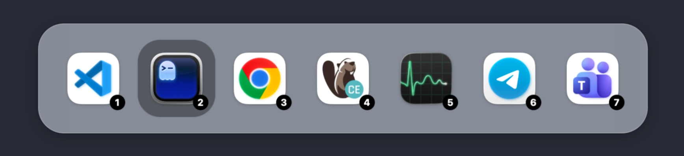

# CmdTab

A lightweight macOS app switcher that replaces Command+Tab.



Works exactly like the built-in switcher, but every app icon shows a number
(1–9). Press a number while holding **Cmd** to jump straight to that app.

- Multiple monitors supported: the switcher opens on the screen of the
  **current app** (the one you're switching away from), so it always appears
  where you're working — falls back to the mouse screen, then the main screen.
- Native Swift/AppKit menu-bar app, no Electron, no timers, no background
  polling. ~0 CPU when idle.

## Build & run

```sh
./build.sh   # produces dist/CmdTab.app
./run.sh     # launches it
```

## First-time setup (required)

CmdTab must read global keyboard events and control other apps, so macOS
blocks it until you grant two permissions.

On first launch, macOS shows the **Input Monitoring** and **Accessibility**
permission dialogs automatically — click **Allow** on both. CmdTab then
starts working immediately; no restart needed. If you missed or denied a
dialog, use the menu bar icon → **Open Permissions…** (or System Settings →
Privacy & Security → enable CmdTab in both panes).

## Usage

| Key                       | Action                                   |
| ------------------------- | ---------------------------------------- |
| Hold **Cmd**, press **Tab** | Open the switcher                        |
| **1–9** while Cmd is held | Switch to that app immediately + focus   |
| **Tab** (Cmd held)        | Cycle forward                            |
| **Shift+Tab** (Cmd held)  | Cycle backward                           |
| Release **Cmd**           | Switch to the selected app and close     |
| **Esc** (Cmd held)        | Close the switcher, do nothing           |
| **Click outside**         | Close the switcher, do nothing           |

Apps are ordered most-recently-used first, so the current app is always
number 1. Switch to Terminal, then it becomes 1 and the previous app becomes
2, and so on. When you open the switcher, the **previous app (#2) is already
focused** — release Cmd to switch to it, or press Tab to keep moving down the
list (native-switcher behavior).

## Debugging

Logging is **off** by default. To turn it on: menu bar icon → **Debug Logging**
(✓ = on), or before launching:

```sh
defaults write com.local.CmdTab CmdTabDebugLog -bool YES
```

When enabled, log lines (permissions, event-tap activity, app order, switches)
are appended to `~/tmp/cmd-tab/log` (menu bar → **Open Log…** reveals it
in Finder). The file is capped at 2 MB. Turn it off with the same menu item or:

```sh
defaults write com.local.CmdTab CmdTabDebugLog -bool NO
```

## Notes & limitations

- The switcher lists the 9 most recently used apps that have windows on screen.
- The system switcher may still appear if you hold **Cmd** alone for over a
  second without pressing Tab. Using the **Cmd+Tab** combo is unaffected.
- The event tap needs your permissions to keep running; re-enable CmdTab in
  both panes if it stops responding after a macOS update. CmdTab watches for
  new grants while running, so it picks them up without a restart.

## What changed

- The switcher opens on the screen of the **current app** (#1), not the
  mouse — with mouse/main-screen fallbacks when the app has no visible
  window. The panel stays on that screen for the whole gesture.
- Fixed multi-monitor placement with displays stacked above the primary
  (e.g. an external monitor above the MacBook screen): the switcher used to
  appear on the *adjacent* screen. Window coordinates from the system are
  anchored at the primary display's top-left, and the conversion now uses
  the right anchor.

- After switching apps, the order updates so the app you switched to is #1 and
  the app you left is #2 — Cmd+Tab toggles back and forth like the native
  switcher (history is updated at switch time, not only via activation events).
- Debug logging: flag-gated (default off), writes to `~/tmp/cmd-tab/log`,
  toggle from the menu bar (see **Debugging** above).
- First launch now triggers macOS's native **Input Monitoring** and
  **Accessibility** permission dialogs (previously the custom alert could
  fail to appear for a menu-bar app).
- Permissions granted while CmdTab is running are picked up automatically
  (a lightweight retry starts the event tap as soon as access is granted;
  previously you had to quit and relaunch).
- Number-row keycodes on macOS are not sequential (4-9 were mapping to the
  wrong app). Digits now use a physical-keycode lookup so every number is exact.
- Number badges now sit centered at the bottom of each icon on a gray pill.
- The switcher opens with the previous app (**#2**) already focused, exactly
  like the native switcher — Cmd+Tab jumps to your last app; press Tab again
  to move further down the list. Shift+Tab opens with the last app focused.
- App order is most-recently-used first (current app is #1).
- Clicking outside the switcher dismisses it without switching apps.
