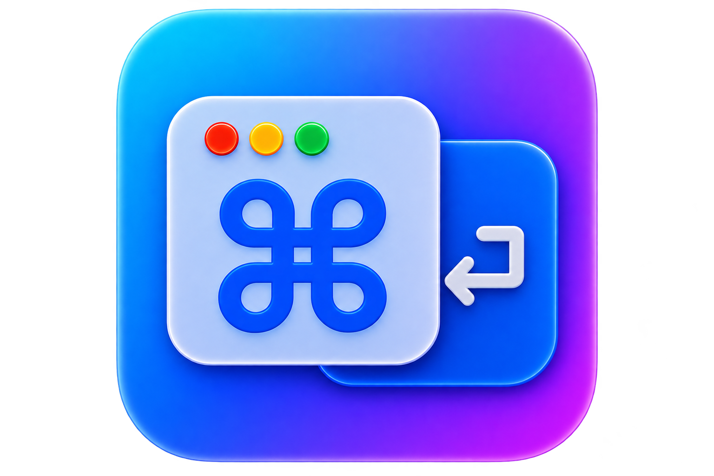

# CmdTab

A macOS app switcher that replaces Cmd+Tab — same behavior, plus numbers.

<p align="center">
  
</p>


## What's different from the native switcher

- Every app shows a number (**1–9**). Hold **Cmd** and press a number to jump straight to that app.
- Opens on the screen of the **current app**, so it always appears where you're working.

Everything else is the native switcher: most-recently-used order, #2 pre-focused, **Tab** / **Shift+Tab** to cycle, release **Cmd** to switch, **Esc** or click outside to cancel.

## Install

### Download (easiest)

Grab the latest `CmdTab.dmg` from [Releases](https://github.com/sonht1109/CmdTab/releases), drag **CmdTab** into Applications, and launch it.

> First launch: right-click → **Open** → **Open** (releases aren't Apple-notarized yet). Then grant **Input Monitoring** and **Accessibility** — macOS prompts on first launch (missed them? menu bar icon → **Open Permissions…**).

### Build from source

```sh
./build.sh   # builds dist/CmdTab.app
./run.sh     # launches it
```

## Releasing

Pushing a `v*` tag triggers [GitHub Actions](.github/workflows/release.yml), which builds
`CmdTab.dmg`/`CmdTab.zip` and creates a GitHub release (`-dev` suffix → pre-release).

```sh
./release.sh dev [--tag v0.1.0-dev.2]   # dev pre-release from develop
./release.sh stable [--tag v0.1.0]      # stable release (merges develop → master)
./release.sh dev --dry-run              # preview the tag without pushing
```

Without `--tag` the last matching tag is bumped (`v0.1.0-dev.2` → `v0.1.0-dev.3`,
`v0.1.0` → `v0.1.1`). Pass `--tag` to pin the version — handy for keeping dev and
stable in sync (ship `v0.1.0-dev.2`, then `v0.1.0`). Tagging manually works too:
`git tag v0.1.0-dev.2 && git push origin v0.1.0-dev.2`.

## Debugging

Menu bar icon → **Debug Logging** (default off) writes to `~/tmp/cmd-tab/log`.

## Limitations

- Lists the 9 most-recently-used apps that have on-screen windows.
- Holding **Cmd** alone for >1s can still trigger the native switcher; **Cmd+Tab** is unaffected.
